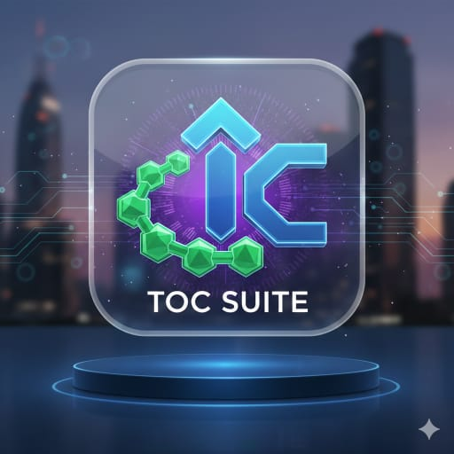

  

# 🌌 Toc-Suite: Unified Automata Studio
**ARCHITECT: [Shiro](https://github.com/shiroonigami23-ui)**

**[🚀 Launch Unified Studio](https://shiroonigami23-ui.github.io/Toc-Suite/)**

A mathematically precise environment for constructing and simulating Finite Automata (DFA/NFA/ε-NFA), Pushdown Automata, Mealy/Moore Machines, and Turing Machines.

---

### 📊 Library Metrics
| Studio | Machine Count | Status |
| :--- | :---: | :--- |
| Finite Automata | **0** | Ready |
| Pushdown Automata | **0** | Ready |
| Mealy/Moore | **0** | Ready |
| Turing Machines | **0** | Ready |
---

## 🛠 Project Architecture

The **Toc-Suite** uses a "Source of Truth" pipeline. The web app consumes aggregated libraries, while the GitHub Actions manage data integrity and sorting.

### 📁 Directory Map
* **`/automata`**: Permanent source storage for individual machines.
* **`/Data`**: Ingestion folder for new machine uploads.
* **`library.json` (Root)**: Aggregated data generated automatically by CI/CD.

### 🤖 Automation Suite
- **Auto-Sorting**: Routes `.json` files to correct subfolders based on machine type.
- **Structural Validation**: Ensures transitions point to existing states.
- **Changelog Logic**: Automatically logs machine imports.
- **Metric Sync**: Updates the table above in real-time.

---

## 📝 Governance
- **📜 [License](./LICENSE)**: MIT.
- **🕒 [Changelog](./CHANGELOG.md)**: Full version history.

---
*Built with architectural precision and logic by Shiro.*
